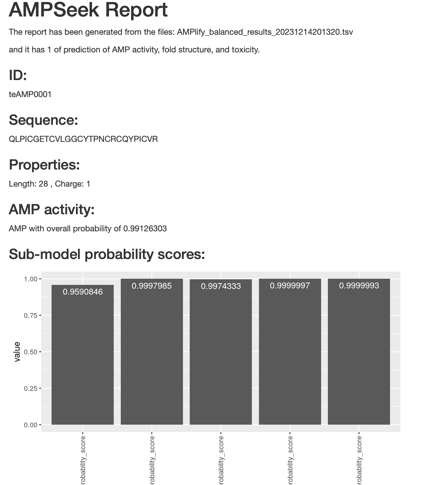
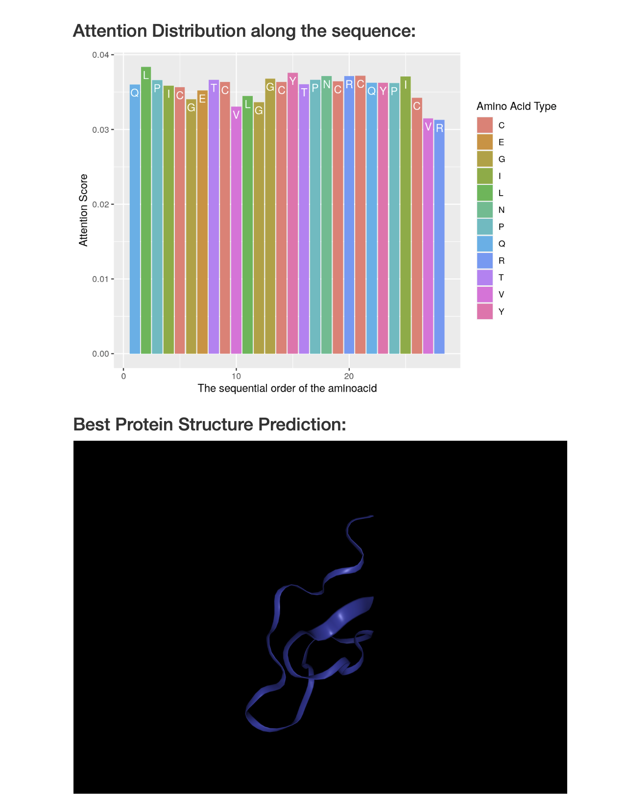

# AMPSeek
Anti-microbial property, protein structure and toxicity prediction from peptide sequences


## Introduction
### Background and Rationale
Microbes developing resistace to the current drugs, Antimicrobial Resistance (AMR) has become a global threat, even one of the biggest of public health and development problems, according to World Health Organization [[1](#references)]. In 2019, almost 5 million deaths related to bacterial AMR worldwide were documented. [[2](#references)]. Moreover, the issue extends beyond health, significantly impacting the global economic balance as well. 
The World Bank estimates global Gross Domestic Product to decrease by 1.1% percent if AMR is still a part of our lives by 2050 [[3](#references)]. This effect is equivalent with the outcome of the Great Recession [[3](#references)]. Luckily, this is an area for proteomics and bioinformatics and scientific community tries to obtain reliable drugs instead of current ones.

One alternative drug which is helpful to AMR is Antimicrobial Peptides (AMPs), short peptide sequences, that are generated by both eukaryotic and prokaryotic organisms [[4](#references)]. AMPs are active agains different microbes like fungi, bacteria, viruses, and yiests [[4](#references)]. Their major mode of action is lysis of the target organism [[4](#references)]. They engage the cell membrane of the target organism based on their charge, hidrophobicity, and 3D structure [[5](#references)]. Since they only engage with the cell wall of the target organism, the possibility of gaining the AMR[[5](#references)]. Due to their wide effects on different target organisms and low-possibility of generating AMR, it is a valid candidate for drug research.

Historically *in vivo* or *in vitro* methods including Nuclear Magnetic Resonance have been used for AMP discovery and evaluation [6]. However, this methods are both time consuming and expensive [[7](#references)]. Thanks to the technological advancements, now prediction of structure, activity, and toxicity of peptides can be done *in silico* [[8,9,10](#references)]. By predicting the AMP structure, activity, and toxicity *in silico*; inexpensive, convinient, fast, and accurate analyses can be done in AMR and AMP research. By identifying the properties of these AMPs, we can detect, and gain information about possible AMP drugs and pave the way for new software that can use predictions.

### Purpose and Main Software
AMPSeek proposes a pipeline to predict AMP activity, structure, and toxicity of a given peptide sequence. It uses `_AMPlify_` [[8](#references)] for activity, `LocalColabFold` [[9](references)] for 3D structure prediction, and `tAMPer` [[10](#references)] for toxicity prediction. 


## Pipeline
This pipeline is built on pipeline manager Nextflow [[11](#references)] and requires `git`, `conda` and `Docker` to run. You can find the installations by clicking on the hyperlinks attached to the text: [Nextflow](https://www.nextflow.io/docs/latest/getstarted.html), [git](https://git-scm.com/book/en/v2/Getting-Started-Installing-Git), [conda](https://conda.io/projects/conda/en/latest/user-guide/install/index.htmlg), [Docker](https://docs.docker.com/engine/install/). If you are using Mac, after installing `Docker` please make sure to follow the steps mentioned [here](https://www.viget.com/articles/how-to-use-docker-on-os-x-the-missing-guide/). If you are using Docker desktop, please make sure `Docker Desktop` is started on your system. I suggest, if you are using Mac, to use Docker Desktop.

### Pipeline Steps
This pipeline is comprised of 4 major and 2 minor steps:

1. PREP: This step installs the given peptide sequence `.fa` file `--download_from <url>` from the internet if the `--download true` flag is used. If not, this step does nothing.
2. RUNAMPLIFY: This step runs `AMPlify` on the input `.fasta` file and saves the result of AMP activity prediction.
3. RUNCOLABFOLD: This step runs `LocalColabFold` on the input `.fa` file and saves the 3D structure prediction.
4. ZIPFOLDS: This step zips the output of `LocalColabFold` to make it usable for `tAMPer`.
5. RUNTAMPER: This step runs `tAMPer` on the input `.fa` and zipped structure files. It saves the toxicity report at the end of its prediction.
6. COMPILERESULTS: This step compiles the results from steps 2, 3, and 5 into a `.html` file.  

### Pipeline Input
This pipeline only takes one input file, a FASTA file. The FASTA file contains a peptide sequence. The pipeline only supports single FASTA files that contain one peptide sequence in them.

The default input is the example input `AMPSeek/data/AMPlify_AMP_test_common.fa`, a modified version of test file `ÀMPlify/data/AMPlify_AMP_test_common.fa`. It contains a peptide sequence that is known to be an AMP. 

Users can download their file from the internet using the flags:
```
nextflow workflow.nf --download_from <url> --download true
```

One other option for users is to manually store the **FASTA** file that want to provide to the pipeline in the folder `AMPSeek/data`. **It is important for users to have only the file that they want to run in that folder, but nothing else. Also currently the pipeline only supports FASTA files that contain only 1 peptide sequence.**

The pipeline can check different peptide sequences in different lengths and predict their activity, 3D structure, charge, and toxicity.

### Intermediate Result Files and Folders:
As a result of prediction and zip stages, pipeline generates different intermediate files. The intermediate generated prediction files for activity, 3D structure, and toxicity are stored in `AMPSeek/output` folder. In this folder:

1. `foldings` folder: This folder contains the output of peptide structure prediction. The pipeline only interact with the `.pbd` files which contain the molecular coordinate information directly. 
2. `*.tsv` file: This is the report of the run for `ÀMPlify`. It contains the data pipeline uses this file for the final report's AMP activity data representation.
3. `foldings/*.csv` file: This file contains the `tAMPer`'s report for the toxicity. The pipeline interacts with this file to generate the final report's AMP activity data representation.

### Output File:
The ultimate output file of the pipeline is the `report.html` file. This report can be found on the root directory after the run. The file contains these information:

1. Information About the Run: Which file is run to generate this document
2. General Information About the Run Peptide Sequence: ID, sequence, length, charge.
3. AMP Activity Information About the Run Peptide Sequence: AMP activity and confidence score, sub model property scores for AMPlify plot (it uses ensamble learning), attention distribution along the sequence that led the AMPlify model to this outcome plot.  
4. Protein Structure About the Run Peptide Sequence: Interactable 3D representation of the protein sequence
5. Toxicity Information About the Run Peptide Sequence: Toxicity score and prediction.

### Installation and Default Run
First, clone this repository to your local:
```
git clone https://github.com/berkeucar/AMPSeek.git
```

Next, change your directory to the project directory:
```
cd AMPSeek
```

Next, if you are using Docker in Linux, make sure Docker daemon is running:
```
docker --version
```
If this does not give any output or an error, run the following:
```
dockerd
```
If the previous not work, please try:
```
sudo dockerd
```

Now, you are ready to run the pipeline (with default inputs):
```
nextflow workflow.nf
```
or you can run pipeline with giving the `<url>` you want your data to download from. 
```
nextflow workflow.nf --download true --download_from <url>
```

**Note**: If you have your data, you can manually put the data into `AMPSeek/data` folder, but you need to delete the example input (`AMPSeek/data/AMPlify_AMP_test_common.fa`).

### Rerun:

Before reruns please do the following: 

1. Make sure there is only 1 file (a FASTA file) in the directory `AMPSeek/data`.
2. Make that FASTA file only contains 1 peptide sequence.
3. Make sure `AMPSeek/output` only contains the folder `AMPSeek/output/foldings` and `AMPSeek/output/foldings` is empty. You can ensure this by deleting the `AMPSeek/output` folder. Please do not use `rm -rf`, due to the permission settings done by `LocalColabFold`. After deleting the `AMPSeek/output` folder you can run the following commands:

```
cd ~
mkdir output
mkdir output/foldings
```

## Result: 
Example output can be found in the folder `AMPSeek/example_output` under the name `example_report.html`. As mentioned earlier, example output can be found in the folder `AMPSeek/data` under the name `AMPlify_AMP_test_common.fa`. This is an AMP so the results are no surprise. It should look like this:





## References
[1] World Health Organization. (2023, November 21). Antimicrobial Resistance. https://www.who.int/news-room/fact-sheets/detail/antimicrobial-resistance

[2] Antimicrobial Resistance Collaborators (2022). Global burden of bacterial antimicrobial resistance in 2019: a systematic analysis. Lancet (London, England), 399(10325), 629–655. https://doi.org/10.1016/S0140-6736(21)02724-0 

[3] World Bank Group. (2017).  Drug-Resistant Infections: A Threat to Our Economic Future. https://documents1.worldbank.org/curated/en/323311493396993758/pdf/final-report.pdf

[4] Reddy, K. V. R., Yedery, R. D., & Aranha, C. (2004). Antimicrobial peptides: Premises and promises. International Journal of Antimicrobial Agents, 24(6), 536–547. https://doi.org/10.1016/j.ijantimicag.2004.09.005

[5] Lei, J., Sun, L., Huang, S., Zhu, C., Li, P., He, J., Mackey, V., Coy, D. H., & He, Q. (2019). The antimicrobial peptides and their potential clinical applications. American Journal of Translational Research, 11(7), 3919–3931.

[6] Porcelli, F., Ramamoorthy, A., Barany, G., & Veglia, G. (2013). On the Role of NMR Spectroscopy for Characterization of Antimicrobial Peptides. In G. Ghirlanda & A. Senes (Eds.), Membrane Proteins: Folding, Association, and Design (pp. 159–180). Humana Press. https://doi.org/10.1007/978-1-62703-583-5_9

[7] Wishart, D. S. (2019). NMR metabolomics: A look ahead. Journal of Magnetic Resonance, 306, 155–161. https://doi.org/10.1016/j.jmr.2019.07.013

[8] Li, C., Sutherland, D., Hammond, S. A., Yang, C., Taho, F., Bergman, L., … Birol, I. (2022). AMPlify: attentive deep learning model for discovery of novel antimicrobial peptides effective against WHO priority pathogens. BMC Genomics, 23(1), 77. https://doi.org/10.1186/s12864-022-08310-4

[9] Mirdita, M., Schütze, K., Moriwaki, Y., Heo, L., Ovchinnikov, S., & Steinegger, M. (2022). ColabFold: Making protein folding accessible to all. Nature Methods, 19(6), Article 6. https://doi.org/10.1038/s41592-022-01488-1

[10] bcgsc/tAMPer: tAMPer: antimicrobial peptides toxicity prediction. (n.d.). Retrieved December 14, 2023, from https://github.com/bcgsc/tAMPer

[11] Di Tommaso, P., Chatzou, M., Floden, E. W., Barja, P. P., Palumbo, E., & Notredame, C. (2017). Nextflow enables reproducible computational workflows. Nature Biotechnology, 35(4), 316–319. doi:10.1038/nbt.3820

