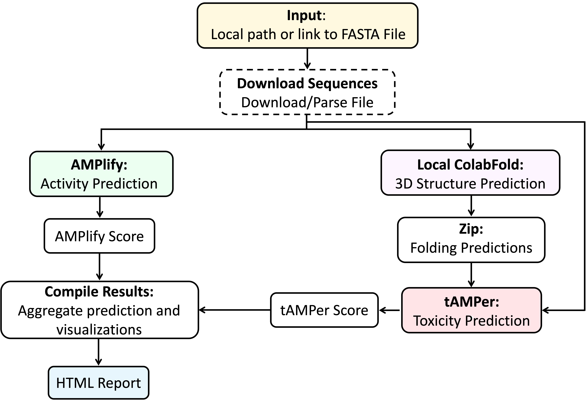
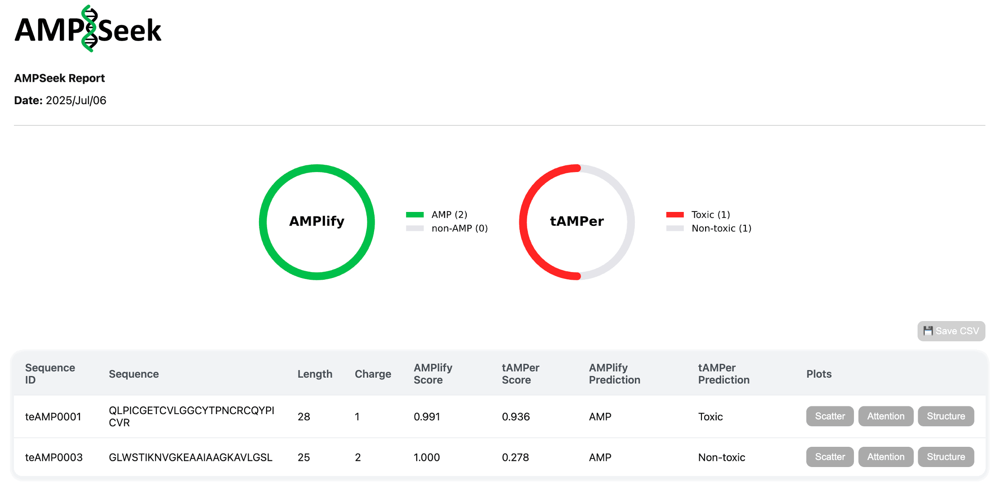

<p align="center">
  
</p>

# AMPSeek
Antimicrobial activity, 3D structure, and toxicity prediction from peptide sequences

## Contents
1. [Description of AMPSeek](#description-of-ampseek)
2. [Installation](#installation)
3. [Quick Start](#quick-start)
4. [Input data](#input-data)
5. [Outputs](#outputs)
6. [Usage](#usage)
7. [Container images](#container-images)
8. [Benchmarks](#benchmarks)
9. [Troubleshooting](#troubleshooting)
10. [Cite](#cite)
11. [License](#license)
12. [Contact](#contact)

---

## Description of AMPSeek
AMPSeek is a reproducible, containerized workflow that predicts *antimicrobial activity*, *tertiary structure*, and *toxicity* of peptide sequences in one run. It orchestrates:
* **AMPlify** for broad‑spectrum antimicrobial activity scoring
* **LocalColabFold** (MMseqs2‑accelerated AlphaFold) for structure prediction
* **tAMPer** for hemolytic & cytotoxicity prediction (sequence + structure features)
* A **compiled HTML report** with interactive plots and per‑peptide summaries

<p align="center">
  
</p

---

## Installation

### Install Nextflow (via Conda)

We recommend installing Nextflow in a dedicated Conda environment:

```bash
conda create -n ampseek -c bioconda nextflow
conda activate ampseek
```

### Install AMPSeek (via Cloning the Repository)

Clone the repository and run with your preferred container profile.

```bash
git clone https://github.com/bcgsc/AMPSeek.git
cd AMPSeek
```
Check if Singularity or Docker is installed properly:
```bash
singularity --version
docker --version
```

## Quick Start

### Linux: 
To run the the pipeline (with default inputs) on Linux choose either Singularity or Docker:
#### • Singularity:
```bash
nextflow AMPSeek.nf -profile singularity
```
#### • Docker:
```bash
nextflow AMPSeek.nf -profile docker
```
### macOS:
To run the the pipeline (with default inputs) on macOS:
#### • Apple Silicon (ARM64)
To run AMPSeek on ARM64, you need to Enable QEMU (once):
```bash
docker run --privileged --rm tonistiigi/binfmt --install amd64
```
Then run the Docker profile: 
```bash
nextflow AMPSeek.nf -profile docker
```
> Emulation is slower; native AMD64 hosts are recommended for large runs.
#### • Apple Intel (AMD64)
To run AMPSeek on AMD64:
```bash
nextflow AMPSeek.nf -profile docker
```


## Input data

* **Format:** single **FASTA** file of peptide sequences
* **Default dataset:** `AMPSeek/data/AMPSeek_data_10.fasta` (10 peptides)
* **Alternative sets:** `AMPSeek/data/alternative_data/` (20, 100 peptides)

You may:

* **Download from the web** at runtime:

  ```bash
  nextflow AMPSeek.nf -profile <docker|singularity> --download_from <url>
  ```

  This will place the file in `AMPSeek/data/` and remove any others there.
* **Manually supply FASTA:** place exactly **one** FASTA in `AMPSeek/data/`, or set a custom path via `--data_path`.

> Keep only the FASTA you intend to process in the input directory, or point the workflow at a specific file with `--data_path`.


## Outputs

Default output directory: `output/`

* **`results.html`** — interactive report with:

  * summary charts (AMPlify & tAMPer distributions, scatter plots)
  * per‑peptide table (activity & toxicity scores, AMPlify attention, interactive 3D structure)
  * CSV export button
  <p align="center">
  
  </p>

* **`foldings/`** — LocalColabFold results per peptide:

  * ZIP per peptide (required by tAMPer), containing **five** PDBs, **3** prediction cycles, **Amber** relaxation
* **`tamper_attention/`** — per‑peptide self‑attention maps (if enabled)

Intermediate TSV/CSV products from AMPlify/tAMPer may be cleaned after report compilation.

## Usage

Common workflow parameters (set on `nextflow run AMPSeek.nf ...`):

| Flag              | Type     |            Default | Description                                                                                               |
| ----------------- | -------- | -----------------: | --------------------------------------------------------------------------------------------------------- |
| `--data_path`     | path     |    `AMPSeek/data/` | Directory or file path to FASTA input. If a directory is provided, ensure it contains **only one** FASTA. |
| `--download_from` | URL      |             *none* | Download a FASTA from the given URL at runtime (replaces other FASTAs in `data/`).                        |
| `--output_path`   | path     |          `output/` | Output directory for results.                                                                             |
| `--output_file`   | string   |     `results.html` | Name of the final HTML report.                                                                            |
| `--threads`       | int      |               `30` | Max threads/CPUs to use.                                                                                  |
| `--time`          | duration | *Nextflow default* | Per‑process timeout (e.g., `1h`, `30 min`).                                                               |
| `--mem`           | memory   | `90%` of available | Per‑process memory limit (e.g., `8 GB`, `32 GB`).                                                         |

> Tool‑specific parameters are fixed to the configurations under which AMPlify and tAMPer were developed/tested. Advanced users may modify `AMPSeek.nf` directly if necessary.

---
## Container images

| Step             | Image                                                 |     Size | Arch  |
| ---------------- | ----------------------------------------------------- | -------: | ----- |
| `RUNAMPLIFY`     | `quay.io/biocontainers/amplify:2.0.1--py36hdfd78af_0` | 748.683 MB | amd64 |
| `RUNCOLABFOLD`   | `biohpc/localcolabfold:1.5`                           | 13.51 GB | amd64 |
| `RUNTAMPER`      | `itsberkeucar/tamper:latest`                          |   4.2 GB | amd64 |
| `COMPILERESULTS` | `itsberkeucar/ampseek-visualization:latest`           | 632.04 MB | amd64 |

> If Docker pulls time out on slow links, set a higher pull timeout in `nextflow.config`, e.g. `docker.pullTimeout = '1h'`.


## Benchmarks

Wall‑clock time and peak RAM on AMD64 with **30 threads**; container images pre‑pulled (download time excluded).

| Dataset                  | Size (KB) | # Peptides | Mean length (aa) |   Peak RAM | Wall time (hh\:mm\:ss) |
| ------------------------ | --------: | ---------: | ---------------: | ---------: | ---------------------: |
| `AMPSeek_data_10.fasta`  |         1 |         10 |           121.30 |   6.5 GB   |           13:03:07     |
| `AMPSeek_data_20.fasta`  |         3 |         20 |           121.35 |   7.0 GB   |             26:14:39   |
| `AMPSeek_data_100.fasta` |        14 |        100 |           121.33 |       -    |            129:48:00   |

> Total disk required for images on first run: \~**19 GB**.


## Troubleshooting

| Symptom                                                | Likely cause                                | Fix                                                                                       |
| ------------------------------------------------------ | ------------------------------------------- | ----------------------------------------------------------------------------------------- |
| *Pipeline aborts with* `Error fetching image to cache` | Not enough space in Singularity cache       | Set a larger cache via `NFX_SINGULARITY_CACHEDIR` (export before running).                |
| Visualization step fails; multiple TSV files present   | Previous run was interrupted before cleanup | Remove intermediate TSVs in the output directory and re‑run.                              |
| Running Docker on ARM64 fails                          | AMD64 images require emulation              | Install QEMU with `docker run --privileged --rm tonistiigi/binfmt --install amd64`.       |
| Unexpected peptides in results                         | Multiple FASTAs present in input directory  | Keep only the intended FASTA in `AMPSeek/data/`, or use `--data_path` to a specific file. |
| Process timeout on HPC                                 | Queue enforces 30–60 min limits             | Increase with `--time` (e.g., `--time '2 h'`).                                            |
| Out‑of‑memory error                                    | Per‑process memory too low                  | Increase with `--mem` (e.g., `--mem '16 GB'`).                                            |
| Docker pull times out                                  | Slow network                                | Add `docker.pullTimeout = '1h'` to `nextflow.config` profile.                             |
| Nothing ran (no AMPlify/ColabFold/tAMPer)              | No FASTA found                              | Place a FASTA in `AMPSeek/data/` or pass `--data_path`.                                   |
---

## Cite

If you use AMPSeek, please cite:

* **AMPlify** — Li *et al.* (2022) *BMC Genomics* 23:77. doi:10.1186/s12864-022-08310-4 [(GitHub)](https://github.com/bcgsc/AMPlify)
* **ColabFold/LocalColabFold** — Mirdita *et al.* (2022) *Nat Methods* 19. doi:10.1038/s41592-022-01488-1 [(GitHub)](https://github.com/sokrypton/ColabFold)
* **tAMPer** —  Ebrahimikondori *et al.* (2024) *Protein Science*. doi:10.1002/pro.5076 [(GitHub)](https://github.com/bcgsc/tAMPer)
* **Nextflow** — Di Tommaso *et al.* (2017) *Nat Biotechnol* 35:316–319. doi:10.1038/nbt.3820 [(GitHub)](https://github.com/nextflow-io/nextflow?tab=readme-ov-file)


## License
AMPSeek Copyright (c) 2022 British Columbia Cancer Agency Branch. All rights reserved.

AMPSeek is released under the GNU General Public License v3

This program is free software: you can redistribute it and/or modify it under the terms of the GNU General Public License as published by the Free Software Foundation, version 3.

This program is distributed in the hope that it will be useful, but WITHOUT ANY WARRANTY; without even the implied warranty of MERCHANTABILITY or FITNESS FOR A PARTICULAR PURPOSE. See the GNU General Public License for more details.

You should have received a copy of the GNU General Public License along with this program. If not, see http://www.gnu.org/licenses/.

For commercial licensing options, please contact Patrick Rebstein (prebstein@bccancer.bc.ca).


## Contact

For questions, issues, or feature requests, please open a GitHub issue.

Contributors:
* Berke Uçar · Emily Zhang · Ali Salehi · Rene Warren · Inanc Birol
